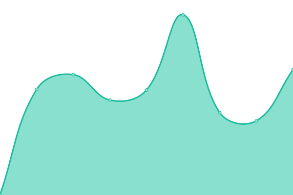
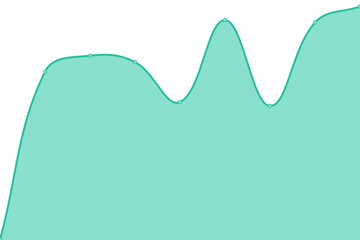

# [📈 Live Status](https://Kovercrosser.github.io/uptime): <!--live status--> **🟩 All systems operational**

This repository contains the open-source uptime monitor and status page for [Manuel Weber](kovercrosser.de), powered by [Upptime](https://github.com/upptime/upptime).

With [Upptime](https://upptime.js.org), you can get your own unlimited and free uptime monitor and status page, powered entirely by a GitHub repository. We use [Issues](https://github.com/Kovercrosser/uptime/issues) as incident reports, [Actions](https://github.com/Kovercrosser/uptime/actions) as uptime monitors, and [Pages](https://Kovercrosser.github.io/uptime) for the status page.

<!--start: status pages-->
<!-- This summary is generated by Upptime (https://github.com/upptime/upptime) -->
<!-- Do not edit this manually, your changes will be overwritten -->
<!-- prettier-ignore -->
| URL | Status | History | Response Time | Uptime |
| --- | ------ | ------- | ------------- | ------ |
|  [Dasbuero2019](https://start.dasbuero2019.de/) | 🟩 Up | [dasbuero2019.yml](https://github.com/Kovercrosser/uptime/commits/HEAD/history/dasbuero2019.yml) | 

 880ms
     
 | 

<a href="https://Kovercrosser.github.io/uptime/history/dasbuero2019">100.00%</a>
    

|  [Kovercrosser](https://kovercrosser.de/) | 🟩 Up | [kovercrosser.yml](https://github.com/Kovercrosser/uptime/commits/HEAD/history/kovercrosser.yml) | 

 1757ms
     
 | 

<a href="https://Kovercrosser.github.io/uptime/history/kovercrosser">100.00%</a>
    

|  [Cloud](https://cloud.dasbuero2019.de/) | 🟩 Up | [cloud.yml](https://github.com/Kovercrosser/uptime/commits/HEAD/history/cloud.yml) | 

 726ms
     
 | 

<a href="https://Kovercrosser.github.io/uptime/history/cloud">100.00%</a>
    

|  [Weeks](https://weeks.kovercrosser.de) | 🟩 Up | [weeks.yml](https://github.com/Kovercrosser/uptime/commits/HEAD/history/weeks.yml) | 

 823ms
     
 | 

<a href="https://Kovercrosser.github.io/uptime/history/weeks">100.00%</a>
    

|  [Matchstats](https://matchstats.dasbuero2019.de) | 🟩 Up | [matchstats.yml](https://github.com/Kovercrosser/uptime/commits/HEAD/history/matchstats.yml) | 

 1103ms
     
 | 

<a href="https://Kovercrosser.github.io/uptime/history/matchstats">100.00%</a>
    

<!--end: status pages-->

[**Visit our status website →**](https://Kovercrosser.github.io/uptime)

## 📄 License

- Powered by: [Upptime](https://github.com/upptime/upptime)
- Code: [MIT](./LICENSE) © [Manuel Weber](kovercrosser.de)
- Data in the `./history` directory: [Open Database License](https://opendatacommons.org/licenses/odbl/1-0/)
